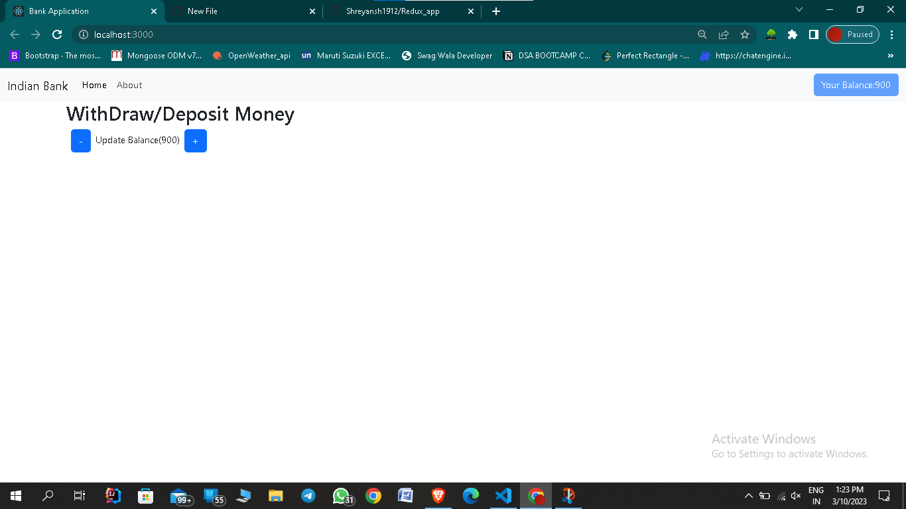

# Redux_app
Redux is an open-source JavaScript library for managing and centralizing application state.This Application is based on the 
concept of Redux, how the Action-creators or reducers work to build a redux-store.

  

